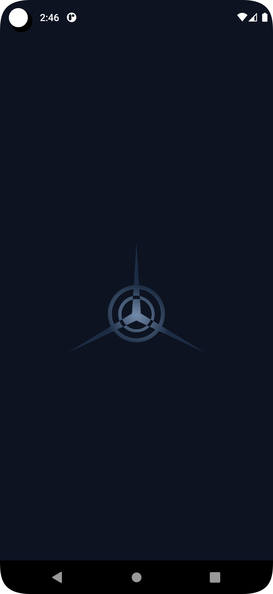
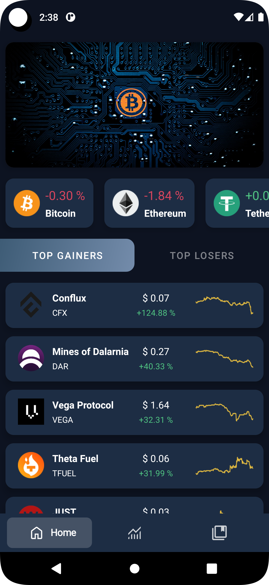
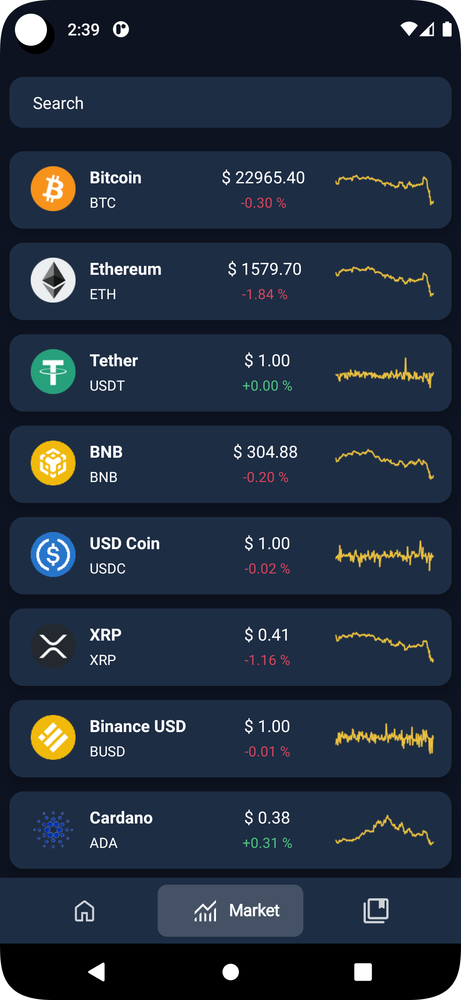
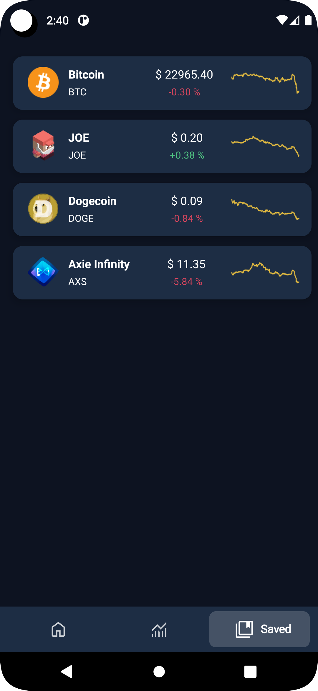
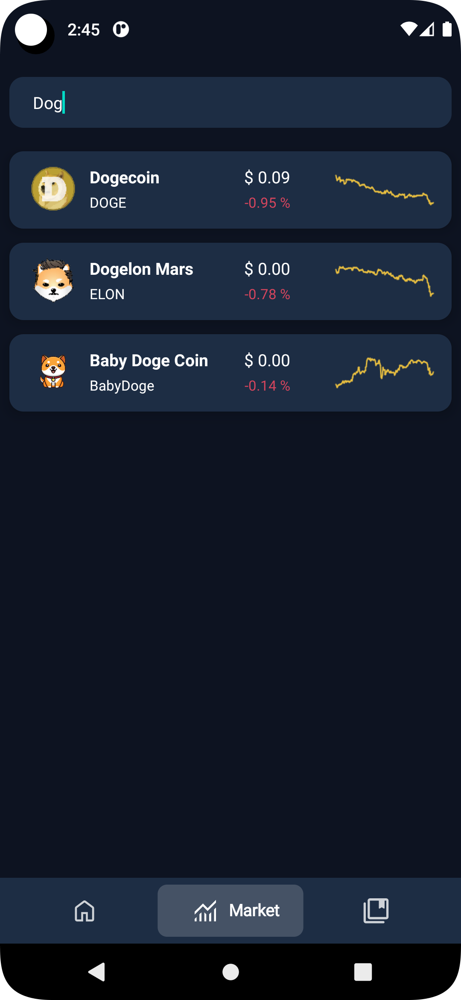
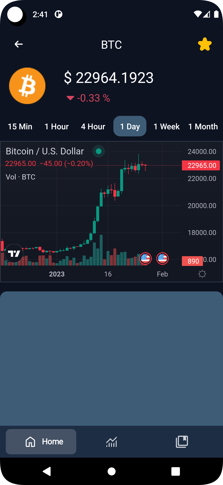

  

<h1 align="center">DeX-Crypto</h1>

A small application based on modern Android application tech-stacks and MVVM architecture. This project is for focusing especially on using API with retrofit, clean User-Interface and MVVM architecture. 

    
      
  
  

## Screenshots

|        Splash Screen         |             Home             |            Market            |
|:----------------------------:|:----------------------------:|:----------------------------:|
|  |      |  |
|            Saved             |            Search            |            Detail            |
|    |  |  |

## Download

Go to the [Releases](https://github.com/deveshp007/DeX-Crypto/releases) to download.

Or directly [Download](https://github.com/deveshp007/DeX-Crypto/releases/download/v1.0.0/dex-crypto.apk) APK.

## Tech stack

- Kotlin
- Material Design
- Splash Screen
  - Animation on logo
- View Binding
- Architecture
  - MVVM Architecture
  - Repository pattern
